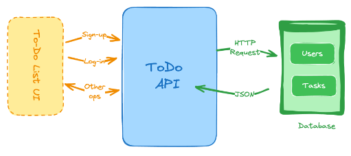

# To-Do List API

A **RESTful API** built with **Node.js**, **Express.js**, and **MongoDB** for managing tasks with **basic authentication**.  
This project goes a step beyond my previous **Blog API** by adding **users**, **authentication middleware**, and linking users to their tasks.

> This Project is Still In Early Development